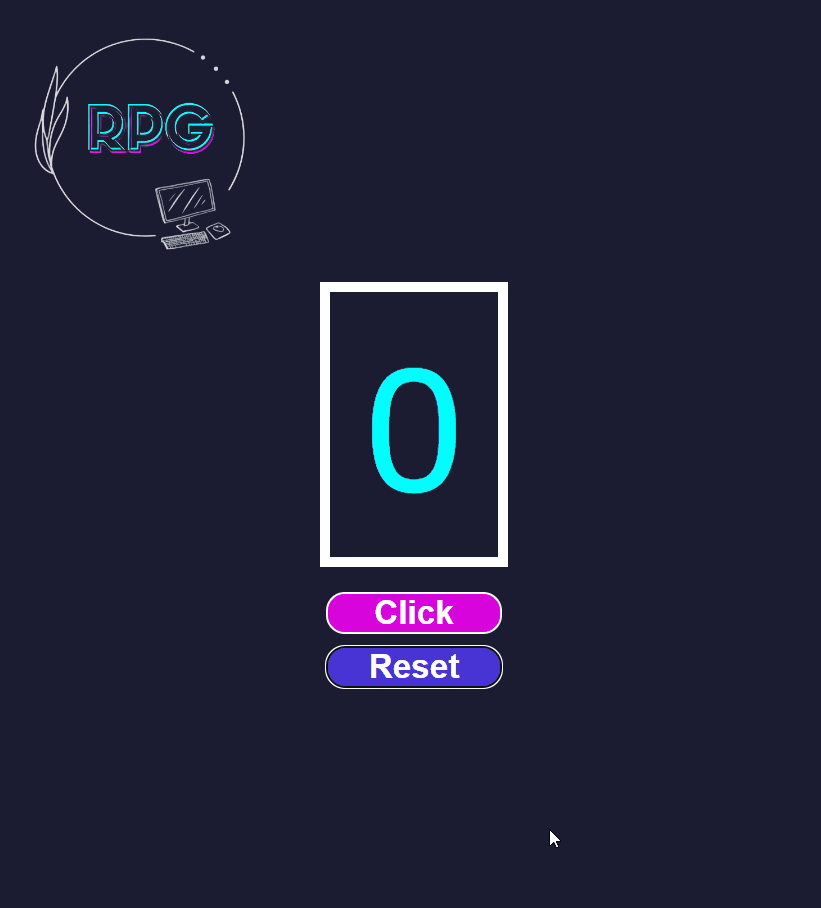

# React counter by [Raquel Peña](https://www.linkedin.com/in/raquel-pe-go/)

A simple React web app to count your clicks!

<h2 id="table-of-contents"> __φ(。。)  Table of Contents</h2>

  
Table of Contents

- [About the project](#about-the-project)
- [Features](#features)
- [Demo](#demo)
- [Key Learning Aspects](#key-learning-aspects)
- [Getting Started](#getting-started)
- [Technologies](#technologies)
- [Contributing](#contributing)
- [Acknowledgments](#acknowledgments)
- [Who is Raquel](#who-is-raquel)

## ٩(⁎❛ᴗ❛⁎)۶ About the project

The Click Counter App is a straightforward web application built with React. It allows users to increment a counter by clicking a button and reset the counter to zero. As the counter reaches specific milestones, fun messages appear below the counter.

## (ﾉ ◕ ヮ ◕)ﾉ\*:･ﾟ ✧ Features

- Click the "Click" button to increase the counter.
- Click the "Reset" button to reset the counter to zero.
- Fun messages appear as you reach certain click milestones.

## ヽ(o ＾ ▽ ＾ o)ノ Demo

You can try the app live [here](https://rpg87.github.io/react-counter-click/)

 
Or you can see an example right here by clicking on the arrow   
 
 

 </img> 

## (◕‿◕)♡ Key Learning Aspects

This Click Counter App project provided an excellent learning experience. Here's what it helped me achieve:

- **Solid React Fundamentals:** By building this project, I gained a deeper understanding of React's core concepts, including components, state management, and event handling.
- **Responsive Design:** The app's responsive design was achieved without relying on media queries. I learned how to create a fluid layout that adapts to various screen sizes.
- **Component-Based Architecture:** I practiced structuring my project in a component-based way, making it more modular and easier to maintain.
- **State Management:** I improved my skills in managing component state, which is crucial in more complex applications.

- **Handling User Interactions:** This project improved my understanding of handling user interactions through the creation of buttons that increment the counter and reset it.
- **Version Control:** This project also reinforced my version control skills using Git and GitHub for collaboration.

The knowledge gained from this project has provided a solid foundation for tackling more advanced and complex web development projects.

## (　･ω･)☞ Getting started

**Clone the repository** to your local machine:

> <code> git clone https://github.com/your-username/click-counter-app.git </code>

**Change the working directory** to the project's root folder:

> <code>cd click-counter-app </code>

**Install the required dependencies:**

> <code> npm install </code>

**Start the development server:**

> <code> npm start </code>

The app should now be running on **http://localhost:3000/**.

## ( ͠° ͟ʖ ͡°) Technologies

- React: A JavaScript library for building user interfaces.
- HTML and CSS: Standard web technologies for structuring and styling the app.

## ＼(＾ ∀ ＾)メ(＾ ∀ ＾)ノ Contributing

Contributions are welcome! If you'd like to contribute to this project, please follow these guidelines:

1. Fork the repository.
2. Create a new branch for your feature or bug fix.
3. Make your changes and test them thoroughly.
4. Create a pull request with a clear description of your changes.

## (✯◡✯) Acknowledgments

Thanks to [Free Code Camp](https://www.freecodecamp.org/) for all the information and free videos.

## ฅ(^◕ᴥ◕^)ฅ Who is Raquel

I am Raquel, I consider myself a person with a great sense of humor, always eager to learn, a lover of challenges and this combination is what led me to study web development.

If you want to know more about me or if you have a fun project and you need help we could work together, you can find me [here](https://www.linkedin.com/in/raquel-pe-go/)

---

---

If you've reached this point in the README, congratulations, you're officially a "ReadMe" champion! 🏆 Thanks for taking the time to explore the Click Counter App. Happy coding and keep clicking away!
